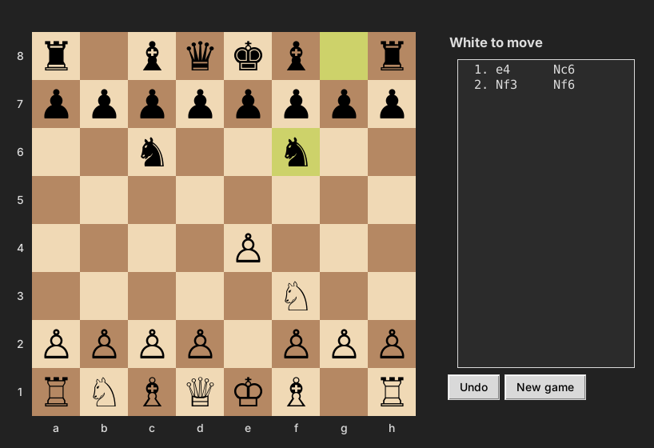

# Chess

A chess engine and desktop game written in Python. It enforces every rule of chess, plays against you with a minimax search, and its move generator is verified against published perft reference counts.



## Features

**Rules engine** (`engine/board.py`)
* Full legal move generation, including castling, en passant, and promotion to any piece
* Check, checkmate, and stalemate detection
* Draws by threefold repetition, the fifty move rule, and insufficient material
* FEN loading, standard algebraic notation (e4, Nxf7+, O-O, exd6, e8=Q#), and undo

**Computer opponent** (`engine/ai.py`)
* Negamax search with alpha beta pruning
* Quiescence search on captures, so it does not stop evaluating in the middle of a trade
* Captures searched first (most valuable victim, least valuable attacker) to speed up pruning
* Evaluation by material plus piece square tables

**Interface** (`gui/app.py`)
* Click to move with legal move hints, last move and check highlighting
* Move list in algebraic notation, undo, and new game
* Play a friend, or the computer as either color (the board flips when you play Black)
* The computer thinks on a background thread, so the window stays responsive

## Run it

Requires Python 3.9 or newer with Tkinter (included with the python.org installers).

```bash
git clone https://github.com/Solo-makinde/Chess.git
cd Chess
python main.py                  # two players
python main.py --ai black       # you play White against the computer
python main.py --ai white -d 4  # you play Black, computer searches 4 moves deep
```

Shortcuts: `u` undoes, `n` starts a new game.

## Testing

```bash
pip install -r requirements.txt
python -m pytest                 # everything, about 30 seconds
python -m pytest -m "not slow"   # skip the deepest perft runs
```

**Perft** walks every legal move sequence to a fixed depth and counts the resulting positions. If one rule is even slightly wrong (a missed en passant, an illegal castle), the count stops matching. The suite checks five standard positions against the reference values on the [Chess Programming Wiki](https://www.chessprogramming.org/Perft_Results):

| Position | Depth | Positions | Result |
|---|---|---|---|
| Starting position | 4 | 197,281 | Pass |
| Kiwipete (castling, pins, en passant) | 3 | 97,862 | Pass |
| Position 3 (endgame, en passant checks) | 5 | 674,624 | Pass |
| Position 4 (promotions, castling rights) | 3 | 9,467 | Pass |
| Position 5 (promotion into check) | 3 | 62,379 | Pass |

Other tests cover checkmate, stalemate, each draw rule, undo, notation, promotion, and the AI finding mate in one, winning free material, and saving its attacked queen.

## How it works

The board is an 8 by 8 list, with row 0 as rank 8. Move generation produces pseudo legal moves for each piece, then filters out any that leave your own king attacked. Each move saves a snapshot so it can be undone exactly, which is what lets both the search and the undo button work.

The AI scores positions in centipawns from White's view. Negamax flips the sign each ply so one function handles both sides, and alpha beta cuts branches that cannot change the result. At depth 3 the computer typically replies in under a second.

## Project structure

```
engine/
  board.py      rules, move generation, draw detection, notation, perft
  ai.py         evaluation and search
gui/
  app.py        Tkinter interface
tests/
  test_perft.py move generation correctness
  test_rules.py game rules, undo, notation
  test_ai.py    search behavior
main.py         command line entry point
```

## Changelog

**v2**
* Split the single script into an engine package, an AI module, and a GUI
* Fixed a bug where the king could move onto a square attacked by an enemy pawn (pawn attack direction was reversed)
* Added the computer opponent, draw rules, undo, move list, and perft test suite
* Fixed piece selection: clicking another of your pieces now switches to it instead of clearing

**v1**
* Two player chess with Tkinter, built to find out how hard a game like this is to make
